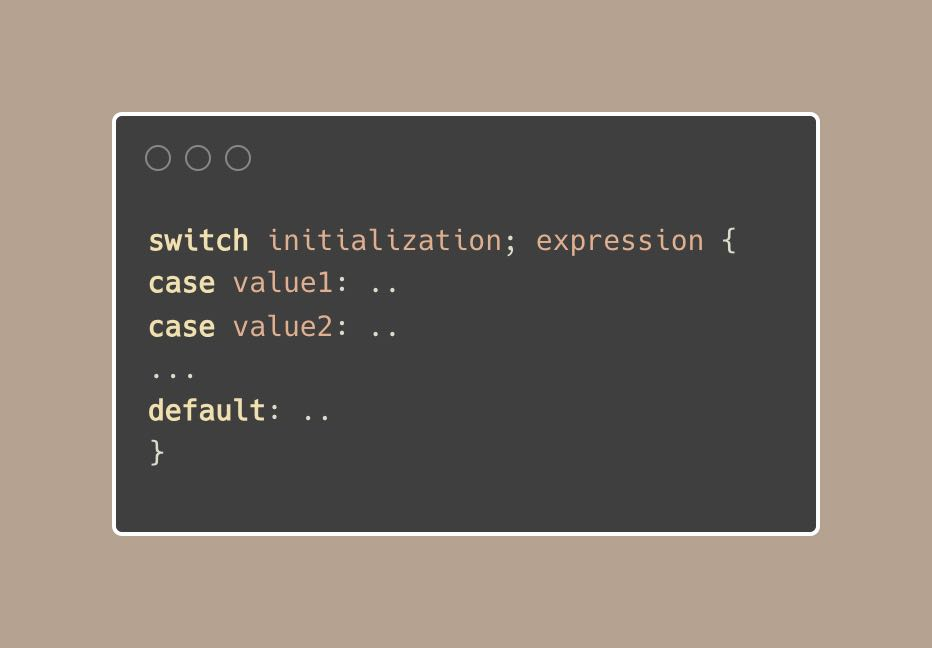
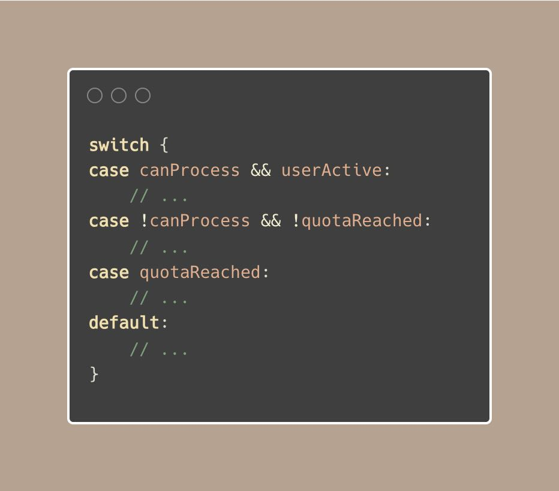

# Tip #28 将多个if-else语句转换为switch

>  原始链接：[Golang Tip #28: Converting multiple if-else statements into switch cases.](https://twitter.com/func25/status/1760648317942600114)

通过多个`if-else`语句处理复杂的条件逻辑是很常见的：

这种方法并没有错。

但是有一个更简洁、更易读的替代方案：将`if-else`转换成`switch`语句

首先，我们应该了解 `switch-case` 结构是如何工作的：

我们可以忽略“初始化”，也可以忽略“表达式”。 当我们这样做时，我们本质上是在写：`switch true {}`，但 true 是隐式的

随后，回到我们的例子，让我们用我们刚刚讨论的内容来增强它：

更多信息：[twitter.com/func25/status/…](https://x.com/func25/status/1745774945920245800?s=46)